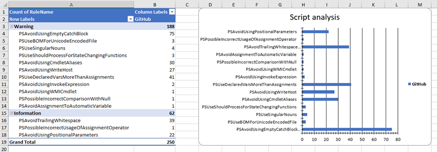
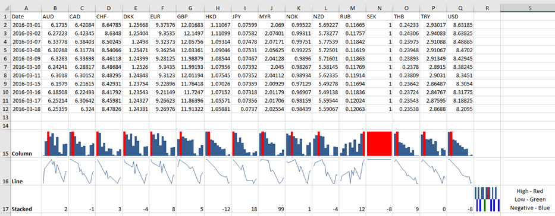
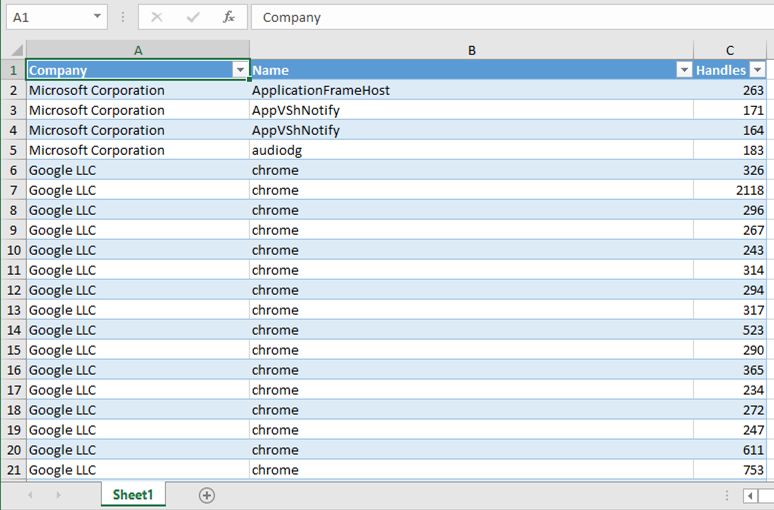

## Donation

If this project helped you reduce the time to get your job done, let me know.

<!-- BADGES -->
[](https://www.paypal.com/cgi-bin/webscr?cmd=_s-xclick&hosted_button_id=UCSB9YVPFSNCY)


<br/>

<p>
<a href="https://www.powershellgallery.com/packages/ImportExcel"></a>
<a href="https://www.powershellgallery.com/packages/ImportExcel"></a>
<a href="./LICENSE.txt"></a>
</p>

| CI System    | Environment                   | Status                                                                                                                                                                                                                                          |
|--------------|-------------------------------|-------------------------------------------------------------------------------------------------------------------------------------------------------------------------------------------------------------------------------------------------|
| AppVeyor     | Windows, Core preview, Ubuntu | [](https://ci.appveyor.com/project/dfinke/importexcel/branch/master)                                                                        |
| Azure DevOps | Windows                       | [](https://dougfinke.visualstudio.com/ImportExcel/_build/latest?definitionId=21&branchName=master)       |
| Azure DevOps | Windows (Core)                | [](https://dougfinke.visualstudio.com/ImportExcel/_build/latest?definitionId=21&branchName=master) |
| Azure DevOps | Ubuntu                        | [](https://dougfinke.visualstudio.com/ImportExcel/_build/latest?definitionId=21&branchName=master)        |
| Azure DevOps | macOS                         | [](https://dougfinke.visualstudio.com/ImportExcel/_build/latest?definitionId=21&branchName=master)         |

<!-- /BADGES -->

PowerShell Import-Excel
-

Install from the [PowerShell Gallery](https://www.powershellgallery.com/packages/ImportExcel/).

This PowerShell Module allows you to read and write Excel files without installing Microsoft Excel on your system. No need to bother with the cumbersome Excel COM-object. Creating Tables, Pivot Tables, Charts and much more has just become a lot easier.


# How to Videos

* [PowerShell Excel Module - ImportExcel](https://www.youtube.com/watch?v=fvKKdIzJCws&list=PL5uoqS92stXioZw-u-ze_NtvSo0k0K0kq)

Installation
-
#### [PowerShell V5](https://www.microsoft.com/en-us/download/details.aspx?id=50395) and Later
You can install the `ImportExcel` module directly from the PowerShell Gallery

* [Recommended] Install to your personal PowerShell Modules folder
```PowerShell
Install-Module ImportExcel -scope CurrentUser
```
* [Requires Elevation] Install for Everyone (computer PowerShell Modules folder)
```PowerShell
Install-Module ImportExcel
```

# Continuous Integration Updates

Big thanks to [Illy](https://github.com/ili101) for taking the Azure DevOps CI to the next level. Improved badges, improved matrix for cross platform OS testing and more.

Plus, wiring the [PowerShell ScriptAnalyzer Excel report](https://github.com/dfinke/ImportExcel/pull/590#issuecomment-488659081) we built into each run as an artifact.



# What's new 7.0.1

More infrastructure improvements.

- Refine pipeline script analysis
- Improve artifacts published
- Add manifest (psd1) checks

# What's new 7.0.0
## Refactor

- Remove all functions from the `psm1`
- Move functions into public subdirectory
- Align TDD and continuous integration workflow for this refactor
- Move help from functions to mdHelp and use [PlatyPS](https://www.powershellgallery.com/packages/platyPS) to generate external help file

Thanks to [James O'Neill](https://twitter.com/jamesoneill) for the refactor and [Illy](https://twitter.com/ili_z) on the continuous integration.

# What's new 6.5.3

Thanks again to the community for making this module even better.

- [Fix import excel headers](https://github.com/dfinke/ImportExcel/pull/713)
- Numerous improvements for DataTables and exporting it to Excel [James O'Neill](https://twitter.com/jamesoneill)
	- Names, styles, proper appending
- Handles marking the empty row on an empty table as dummy row
- Re-work code based on linting recommendations
- Update existing tests and add more
- Support PipelineVariable thanks to [Luc Dekens](https://twitter.com/LucD22) for reporting and [Ili](https://twitter.com/ili_z) for the PR
- Fix quoting in ConvertFromExcelToSQLInsert [beckerben](https://github.com/beckerben)

# What's new 6.5.2

Thank you [uSlackr](https://github.com/uSlackr)ill
- Fixes Column order issue (plus tests) for `Get-ExcelColumnName`

Thank you [jhoneill](https://github.com/jhoneill)
- Added -Force to Send-SQLDataToExcel so it sends something even if no rows are returned. (see [#703](https://github.com/dfinke/ImportExcel/issues/703))
- Added -asText to import-Excel see (#164)[https://github.com/dfinke/ImportExcel/issues/164] and multiple others
- Linux. Now set an environment variable if the support needed for Autosize is present, and use that Environment variable to decide to skip autosize operations.
- Fixed tests which needed autosize to work so they skip of the environment variable is set.
- Fixed another break where on azure the module never loaded.
- Add a comment to ci.ps1 re better .NET version detection and left some commented out code.

Other
- Added the example [ReadAllSheets.ps1](https://github.com/dfinke/ImportExcel/tree/master/Examples/ReadAllSheets) based on this thread https://github.com/dfinke/ImportExcel/issues/678

# What's new 6.5.0

This is now using the latest version of EPPlus. Unit tests are updated and passing, if you hit problems, please open an issue.
You can rollback to an older version from the PowerShell Gallery if you are blocked.

- Unit tests were updated and fixed
- "Set-WorksheetProtection" is now switched on
- Made a change to make Set-Excel range more friendly when Auto Sizing on non-windows platforms
- Fixed - Windows only tests don't attempt to run on non-windows systems
- Tests based on Get-Process don't attempt to run if <20 processes are returned
- If $env:TEMP is not set (as will be the case on Linux)
- Join-Path if used so paths are built with / or with \ as suits the OS where the test is running.
- Excel Sparklines now supported, check out the examples [SalesByQuarter](https://github.com/dfinke/ImportExcel/blob/master/Examples/Sparklines/SalesByQuarter.ps1) and [Sparklines](https://github.com/dfinke/ImportExcel/blob/master/Examples/Sparklines/Sparklines.ps1).




# What's new 6.2.4

Sensible parameter defaults, make your life easier and gets things done faster.

- Thank you to [DomRRuggeri](https://github.com/DomRRuggeri) for the initial Out-Excel PR and kicking off the conversation on the improvements.
- Thank you to [ili101](https://github.com/ili101) for refactoring and improving the defaults, and adding the tests for parameters.

- Creates a table, with filtering
- Chooses a `TableStyle`
- Displays the Excel spreadsheet automatically

```powershell
Get-Process | select Company, Name, Handles | Export-Excel
```



# What's new 6.2.3

Thank you [jhoneill](https://github.com/jhoneill).

- Refactored copy sheet and added pipe support
- Add `ClearAll` to `Set-ExcelRange`
- Fix broken test & regression for `passwords`
    - **Note**: Passwords do not work on `pwsh`. The EPPlus library does not support these dotnet core APIs at this time.

# What's new 6.2.2

- Added requested feature, chart trendlines.
    - [Example PowerShell script](https://github.com/dfinke/ImportExcel/blob/master/Examples/Charts/NumberOfVisitors.ps1)


- Fixed Import-Excel and relative path issue, added unit tests.

# What's new 6.2.0
Thank you to [James O'Neill](https://github.com/jhoneill)

- Fixed, Import-Excel can read xlsx files even if already open in Excel
- Added `New-ExcelStyle`, plus `-Style` to `Export-Excel` and `-Merge` to `Set-ExcelRange`
- Added [Style Examples](https://github.com/dfinke/ImportExcel/tree/master/Examples/Styles)


# What's new 6.1.0

Thank you to [James O'Neill](https://github.com/jhoneill)
- Instead of specifying a path provides an Excel Package object (from `Open-ExcelPackage`), using this avoids re-reading the whole file when importing multiple parts of it. To allow multiple read operations `Import-Excel` does NOT close the package, and you should use `Close-ExcelPackage -noSave` to close it.

# What's new 6.0.0

Thank you to [James O'Neill](https://github.com/jhoneill) for the optimizations, and refactoring leading to a ***~10x*** speed increase. Thanks to [ili101](https://github.com/ili101) for earlier PRs that provided the ground work for this.

* Performance improvement to `Export-Excel` see [#506](https://github.com/dfinke/ImportExcel/issues/506) and [#555](https://github.com/dfinke/ImportExcel/issues/555). This has meant taking code in Add-CellValue back into process block of `Export-Excel`, as the overhead of calling the function was a lot greater than time executing the code inside it. [Blog post to follow](https://jamesone111.wordpress.com/). Some tests are showing a ***~10x*** speed increase. [#572](https://github.com/dfinke/ImportExcel/issues/572) was about a broken #region tag in this part of the code and that has been cleaned up in the process.

* `Export-Excel` now has an -InputObject parameter (this was previously -TargetData , which is now an alias for InputObject).
If the `inputobject` is an array, each item will be inserted, so you can run `export-excel -inputobject $x` rather than `$x | Export-Excel`, and if it is a `system.data.datatable` object it will be inserted directly rather than cell-by-cell. `Send-SQLDataToExcel` takes advantage of this new functionality. There are simple tests for these new items

* `Export-Excel` previously assumed `-Now` if there were no other parameters, it will now assume `-Now` if there is no `-Path` or `-ExcelPackage`.
The .PSD1 file now itemizes the items exported by the module [#557](https://github.com/dfinke/ImportExcel/issues/557)

# What's new 5.4.5

Thank you to [James O'Neill](https://github.com/jhoneill) for the great additions.

- Modified Send-SQLDataToExcel so it creates tables and ranges itself; previously it relied on export-excel to do this which cause problems when adding data to an existing sheet (#555)
- Added new command Add-ExcelDataValidation which will apply different data-validation rules to ranges of cells
- Changed the export behavior so that (1) attempts to convert to a number only apply if the the value was a string; (2) Nulls are no longer converted to an empty string (3) there is a specific check for URIs and not just text which is a valid URI. Using UNC names in hyperlinks remains problematic.
- Changed the behavior of AutoSize in export excel so it only applies to the exported columns. Previously if something was exported next to pre-existing data, AutoSize would resize the whole sheet, potentially undoing things which had been set on the earlier data. If anyone relied on this behavior they will need to explicitly tell the sheet to auto size with $sheet.cells.autofitColumns. (where $sheet points to the sheet, it might be $ExcelPackage.Workbook.Worksheets['Name'])
- In Compare-Worksheet,the Key for comparing the sheets can now be written as a hash table with an expression - it is used with a Group-Object command so if it is valid in Group-Object it should be accepted; this allows the creation of composite keys when data being compared doesn't have a column which uniquely identifies rows.
-  In Set-ExcelRange , added a 'Locked' option equivalent to the checkbox on the Protection Tab of the format cells dialog box in Excel.
- Created a Set-WorksheetProtection function. This gives the same options the protection dialog in Excel but is 0.9 release at the moment.

## New Example

- Added [MutipleValidations.ps1](https://github.com/dfinke/ImportExcel/blob/master/Examples/ExcelDataValidation/MutipleValidations.ps1). Culled from the `tests`.

# What's new 5.4.4

- Fix issue when only a single property is piped into Export-Excel
- Fix issue in `Copy-ExcelWorksheet`, close the `$Stream`

# What's new 5.4.3

- Added Remove-Worksheet: Removes one or more worksheets from one or more workbooks

# What's new 5.4.2

- Added parameters -GroupDateRow and -GroupDatePart & -GroupNumericRow, -GroupNumericMin, -GroupNumericMax and -GroupNumericInterval
  to Add-PivotTable and New-PivotTableDefinition. The date ones gather dates of the same year and/or quarter and/or month and/or day etc.
  the number ones group numbers into bands, starting at Min, and going up steps specified by Interval. Added tests and help for these.
- Set-ExcelRow and Set-ExcelColumn now check that the worksheet name they passed exists in the workbook.


# What's new 5.4.0

- Thank you to Conrad Agramont, Twitter: [@AGramont](https://twitter.com/@AGramont) for the `AddMultiWorkSheet.ps1` example. Much appreciated!
- Fixed several more bugs where parameters were ignored if passed a zero value
- Fixed bug where chart series headers could not come form a cell reference (=Sheet1!Z10 now works as a header reference)
- Add-Chart will now allow a single X range, or as many X ranges as there are Y ranges.
- Merge-MultipleSheets is more robust.
- Set-ExcelRow and Set-ExcelColumn trap attempts to process a sheet with no rows/columns.
- Help has been proof-read (thanks to Mrs. @Jhoneill !).

# What's new 5.3.4

- HotFix for parameter PivotTableStyle should be PivotTableStyle https://github.com/dfinke/ImportExcel/issues/453

# What's new 5.3.3

- Thank you to (lazywinadmin)[https://github.com/lazywinadmin] - Expand aliases in examples and elsewhere
- In Export-Excel fixed a bug where -AutoNameRange on pre-existing data included the header in the range.
- In Export-Excel fixed a bug which caused a zero, null, or empty string in a list of simple objects to be skipped.
- In Export-Excel improved the behaviour when a new worksheet is created without data, and Tables etc are added to it.
- In Join-Worksheet: added argument completer to  -TitleBackgroundColor and set default for -TitleBackgroundStyle to 'Solid'.
- In Add-Excel chart, New-ExcelChart, tests and Examples fixed mis-spelling of "Position"
- In Send-SqlDataToExcel: improved robustness of check for no data returned.
- In Set-ExcelColumn: -column can come from the pipeline (supporting an array introduces complications for supporting script blocks); -AutoNameRange no longer requires heading to specified (so you can do 1..10 | Set-ExcelColumn -AutoNameRange );  In Set-ExcelRow: -Row can come from the pipeline
- Improved test coverage (back over 80%).
- Help and example improvements. In "Index - music.ps1" the module for querying the index can be downloaded from PowerShell gallery #requires set to demand it. In SQL+FillColumns+Pivot\example2.ps1 the GetSQL module can be downloaded and #Requires has been set. The F1 results spreadsheet is available from one drive and a link is provided.

- Added Azure DevOps continuous integration and badges <a href="https://dougfinke.visualstudio.com/ImportExcel/_build?definitionId=10"></a>


# What's new in Release 5.3

- Help improvements and tidying up of examples and extra examples
- Open-Excel Package and Add-Worksheet now add worksheets as script properties so `$Excel = Open-ExcelPackage -path test.xlsx ; $excel.sheet1` will return the sheet named "sheet1" `$Excel.SheetName` is a script property which is defined as `$this.workbook.worksheets["Sheetname"]`
- Renamed Set-Column to `Set-ExcelColumn`, Set-Row to `Set-ExcelRow`, and Set-Format, to `Set-ExcelRange`. Added aliases so the old names still work.
- `Set-ExcelRange` (or set-Format) used "Address" and "Range" incorrectly. There is now a single parameter `-Range`, with an alias of "Address".  If the worksheet parameter is present, the function accepts a string specifying cells ("A1:Z10") or a the name of range. Without the worksheet it accepts an object representing a named range or a Table; or a tables's address, or part of the worksheet.cells collection.
- `Add-ConditionalFormatting`: Used "address" correctly, and it will accept ranges in the address parameter (range is now an alias for address). It now wraps conditional value strings in quotes when needed (for = <= >= operations string needs to be in double quotes see issue #424). Parameter intellisense has been improved. There are new parameters: `-StopIfTrue` and `-Priority` and support for using the `-Reverse` parameter with Color-scale rules (issue #430).  Booleans in the sheet are now supported as the value for a condition. Also brought the two different kinds of condition together inside Export-Excel, and fixed a bug where named-ranges didn't work in some places. In `New-ConditionalText`, more types of conditional format are supported, and the argument completer for -ConditionalTextColor was missing and has been added.
- Improved handling of hyperlinks in `Export-Excel` (see issue #426)s
- `Export-Excel` has better checking of Table and PivotTable names (for uniqueness) and a new test in quick charts that there is suitable data for charting. It also accepts hash tables for chart, pivot table and conditional formatting parameters which are splatted into the functions which add these.
- Moved logic for adding a named-range out of Export-Excel and into a new function named `Add-ExcelName`, and logic for adding a table into a function named `Add-ExcelTable`; this is to make it easier to do these things independently of Export-Excel, but minimize duplication. The Add-ExcelTable command has extra parameters to toggle the options from table tools toolbar (show totals etc.) and set options in the totals row.
- Moved PivotTable Functions out of Export-Excel.PS1 into their own file and moved Add-ExcelChart out of Export-Excel.ps1 into New-ExcelChart.ps1
- Fixed bug in Merge-MultipleSheets  where background pattern was set to None, making background color invisible.
- Fixed issues where formatting could be reset when using Export-Excel to manipulate an existing sheet without appending data; this applied to number-formats and tables.
- `Add-PivotTable` has some new parameters `-PassThru` returns the pivot table (e.g. to allow names /sort orders of data series to be tweaked )  `-Address`  allows Pivot to be placed on an existing sheet; `-PivotTableStyle` allows a change from "Medium6", `-PivotNumberFormat` formats data cells. It is more flexible about how the source data is specified - copying the range options in Set-ExcelRange. `Add-ExcelChart` is now used for creating PivotCharts, and `-PivotChartDefinition`  allows a definition created with `New-ExcelChartDefinition` to be used when setting up a PivotTable. This opens up all the things that Add-ExcelChart can do without duplicating the parameters on Add-Pivot table and Export-Excel.  Definition, TableStyle, Numberformat and ChartDefiniton can be used in `New-PivotTableDefinition` .
- `Add-ExcelChart` now supports -PassThru to return the chart for tweaking after creation; there is now a -PivotTable parameter to allow Add-PivotTable to call the code in Add-ExcelChart. And in `New-ExcelChartDefinition` Legend parameters (for size, bold & position ) are now supported
- ChartDefinition and conditional formatting parameters can now be hashtables - anything that splats  Add-ExcelChart or Add-ConditionalFormatting, it should be acceptable as a definition.


# What's new in Release 5.2
- Value does not need to be mandatory in Set-Row or Set-Column, also tidied their parameters a little.
- Added support for array formulas in Set-Format (it really should be set range now that it sets values, formulas and hyperlinks - that can go on the to-do list )
- Fixed a bug with -Append in Export-Excel which caused it to overwrite the last row if the new data was a simple type.
- NumberFormat in Export-Excel now sets the default for on a new / blank sheet; but [still] sets individual cells when adding to a sheet
- Added support for timespans in Export excel ; set as elapsed hours, mins, secs [h]:mm:sss
- In Export-Excel improved the catch-all handler for insuring values to cope better with nested objects (#419) and reduce the number of parse operations
- Added -Calculate switch to Export-Excel and Close-Excel Package; EPPlus needs formulas to OMIT the leading = sign so where formula is set it now strips a leading = sign
- Added -PivotTotals parameter where there was already -NoTotalsInPivot new one allows None, Both, Rows, Columns. (#415)
- When appending Export-Excel only extended tables and ranges if they were explicitly specified. It now does it automatically.
- Compare and Merge worksheet originally had a problem with > 26 columns, I fixed merge turns out I hadn't fixed compare ... I have now
- Fixed bug where Export-Excel would not recognize it had to set  $TitleFillPattern - made the default 'Solid'
- ExcludeProperty in Export-Excel now supports wildcards.
- Added DateTime to the list of types which can be exported as single column.
- Added Password support to Open- and Close-ExcelPackage (password was not doing anything in Export-Excel)
- Gave Expand-NumberFormat a better grasp of currency layouts - it follows .NET which is not always the same as Excel would set:-(

# What's new in Release 5.1.1
- Set-Row and Set-Column will now create hyperlinks and insert dates correctly
- Import-Excel now has an argument completer for Worksheet name - this can be slow on large files
- The NumberFormat parameter (in Export-Excel, Set-Row, Set-Column, Set-Format and Add-ConditionalFormat) and X&YAxisNumberFormat parameters (in New-ExcelChartDefinition and Add-ExcelChart) now have an argument completer and the names Currency, Number, Percentage, Scientific, Fraction, Short Date ,Short time,Long time, Date-Time and Text will be converted to the correct Excel formatting strings.
- Added new function Select-Worksheet to make a named sheet active: Added -Activate switch to Add-Worksheet, to make current sheet active, Export-Excel and Add-PivotTable support -Activate and pass it to Add-Worksheet, and New-PivotTableDefinition allows it to be part of the Pivot TableDefinition.
- Fixed a bug in Set-Format which caused -Hidden not to work
- Made the same changes to Add-Conditional format as set format so -switch:$false is processed, and 0 enums and values are processed correctly
- In Export-Excel, wrapped calls to Add-CellValue in a try catch so a value which causes an issue doesn't crash the whole export but generates a warning instead (#410) .
- Additional tests.

# What's new to July 18
- Changed parameter evaluation in Set-Format to support -bold:$false (and other switches so that if false is specified the attribute will be removed ), and to bug were enums with a value of zero, and other zero parameters were not set.
- Moved chart creation into its own function (Add-Excel chart) within Export-Excel.ps1. Renamed New-Excelchart to New-ExcelChartDefinition to make it clearer that it is not making anything in the workbook (but for compatibility put an alias of New-ExcelChart in so existing code does not break). Found that -Header does nothing, so it isn't Add-Excel chart and there is a message that does nothing in New-ExcelChartDefinition .
- Added -BarChart -ColumnChart -LineChart -PieChart parameters to Export-Excel for quick charts without giving a full chart definition.
- Added parameters for managing chart Axes and legend
- Added some chart tests to Export-Excel.tests.ps1. (but tests & examples for quick charts , axes or legends still on the to do list )
- Fixed some bad code which had been checked-in in-error and caused adding charts to break. (This was not seen outside GitHub #377)
- Added "Reverse" parameter to Add-ConditionalFormatting ; and added -PassThru to make it easier to modify details of conditional formatting rules after creation (#396)
- Refactored ConditionalFormatting code in Export excel to use Add-ConditionalFormatting.
- Rewrote Copy-ExcelWorksheet to use copy functionality rather than import | export (395)
- Found sorts could be inconsistent in Merge-MultipleWorksheet, so now sort on more columns.
- Fixed a bug introduced into Compare-Worksheet by the change described in the June changes below, this meant the font color was only being set in one sheet, when a row was changed. Also found that the PowerShell ISE and shell return Compare-Object results in different sequences which broke some tests. Applied a sort to ensure things are in a predictable order.  (#375)
- Removed (2) calls to Get-ExcelColumnName (Removed and then restored function itself)
- Fixed an issue in Export-Excel where formulas were inserted as strings if "NoNumberConversion" is applied (#374), and made sure formatting is applied to formula cells
- Fixed an issue with parameter sets in Export-Excel not being determined correctly in some cases (I think this had been resolved before and might have regressed)
- Reverted the [double]::tryParse in export excel to the previous (longer) way, as the shorter way was not behaving correctly with with the number formats in certain regions. (also #374)
- Changed Table, Range and AutoRangeNames to apply to whole data area if no data has been inserted OR to inserted data only if it has.(#376) This means that if there are multiple inserts only inserted data is touched, rather than going as far down and/or right as the furthest used cell. Added a test for this.
- Added more of the Parameters from Export-Excel to Join-worksheet, join just calls export-excel with these parameters so there is no code behind them (#383)
- Added more of the Parameters from Export-Excel to Send-SQLDataToExcel, send just calls export-excel with these parameters...
- Added support for passing a System.Data.DataTable directly to Send-SQLDataToExcel
- Fixed a bug in Merge-MultipleSheets where if the key was "name", columns like "displayName" would not be processed correctly, nor would names like "something_ROW". Added tests for Compare, Merge and Join Worksheet
- Add-Worksheet , fixed a regression with move-after (#392), changed way default worksheet name is decided, so if none is specified, and an existing worksheet is copied (see June additions) and the name doesn't already exist, the original sheet name will be kept. (#393) If no name is given an a blank sheet is created, then it will be named sheetX where X is the number of the sheet (so if you have sheets FOO and BAR the new sheet will be Sheet3).

# New in June 18
- New commands - Diff , Merge and Join
    - `Compare-Worksheet` (introduced in 5.0) uses the built in `Compare-object` command, to output a command-line DIFF and/or color the worksheet to show differences. For example, if my sheets are Windows services the *extra* rows or rows where the startup status has changed get highlighted
    - `Merge-Worksheet` (also introduced in 5.0) joins two lumps, side by highlighting the differences. So now I can have server A's services and Server Bs Services on the same page.  I figured out a way to do multiple sheets. So I can have Server A,B,C,D on one page :-) that is `Merge-MultpleSheets`
    For this release I've fixed heaven only knows how many typos and proof reading errors in the help for these two, the only code change is to fix a bug if two worksheets have different names, are in different files and the Comparison sends the delta in the second back before the one in first, then highlighting changed properties could throw an error. Correcting the spelling of Merge-MultipleSheets is potentially a breaking change (and it is still plural!)
    also fixed a bug in compare worksheet where color might not be applied correctly when the worksheets came from different files and  had different name.
    - `Join-Worksheet` is **new** for this release. At it's simplest it copies all the data in Worksheet A to the end of Worksheet B
- Add-Worksheet
    - I have moved this from ImportExcel.psm1 to ExportExcel.ps1 and it now can move a new worksheet to the right place, and can copy an existing worksheet (from the same or a different workbook) to a new one, and I set the Set return-type to aid intellisense
- New-PivotTableDefinition
    - Now Supports  `-PivotFilter` and `-PivotDataToColumn`, `-ChartHeight/width` `-ChartRow/Column`, `-ChartRow/ColumnPixelOffset` parameters
- Set-Format
    - Fixed a bug where the `-address` parameter had to be named, although the examples in `export-excel` help showed it working by position (which works now. )
- Export-Excel
    - I've done some re-factoring
        1. I "flattened out" small "called-once" functions , add-title, convert-toNumber and Stop-ExcelProcess.
        2. It now uses Add-Worksheet, Open-ExcelPackage and Add-ConditionalFormat instead of duplicating their functionality.
        3. I've moved the PivotTable functionality (which was doubled up) out to a new function "Add-PivotTable" which supports some extra parameters PivotFilter and PivotDataToColumn, ChartHeight/width ChartRow/Column, ChartRow/ColumnPixelOffsets.
        4. I've made the try{} catch{} blocks cover smaller blocks of code to give a better idea where a failure happened, some of these now Warn instead of throwing - I'd rather save the data with warnings than throw it away because we can't add a chart. Along with this I've added some extra write-verbose messages
    - Bad column-names specified for Pivots now generate warnings instead of throwing.
    - Fixed issues when pivot tables / charts already exist and an export tries to create them again.
    - Fixed issue where AutoNamedRange, NamedRange, and TableName do not work when appending to a sheet which already contains the range(s) / table
    - Fixed issue where AutoNamedRange may try to create ranges with an illegal name.
    - Added check for illegal characters in RangeName or Table Name (replace them with "_"), changed tablename validation to allow spaces and applied same validation to RangeName
    - Fixed a bug where BoldTopRow is always bolds row 1 even if the export is told to start at a lower row.
    - Fixed a bug where titles throw pivot table creation out of alignment.
    - Fixed a bug where Append can overwrite the last rows of data if the initial export had blank rows at the top of the sheet.
    - Removed the need to specify a fill type when specifying a title background color
    - Added MoveToStart, MoveToEnd, MoveBefore and MoveAfter Parameters - these go straight through to Add worksheet
    - Added "NoScriptOrAliasProperties" "DisplayPropertySet" switches (names subject to change) - combined with ExcludeProperty these are a quick way to reduce the data exported (and speed things up)
    - Added PivotTableName Switch (in line with 5.0.1 release)
    - Add-CellValue now understands URI item properties. If a property is of type URI it is created as a hyperlink to speed up Add-CellValue
        - Commented out the write verbose statements even  if verbose is silenced they cause a significant performance impact and if it's on they will cause a flood of messages.
        - Re-ordered the choices in the switch and added an option to say "If it is numeric already post it as is"
        - Added an option to only set the number format if doesn't match the default for the sheet.
- Export-Excel Pester Tests
    -   I have converted examples 1-9, 11 and 13 from Export-Excel help into tests and have added some additional tests, and extra parameters to the example command to get better test coverage. The test so far has 184 "should" conditions grouped as 58 "IT" statements; but is still a work in progress.
- Compare-Worksheet pester tests

---


- [James O'Neill](https://twitter.com/jamesoneill) added `Compare-Worksheet`
    - Compares two worksheets with the same name in different files.

#### 4/22/2018
Thanks to the community yet again
- [ili101](https://github.com/ili101) for fixes and features
    - Removed `[PSPlot]` as OutputType. Fixes it throwing an error
- [Nasir Zubair](https://github.com/nzubair) added `ConvertEmptyStringsToNull` to the function `ConvertFrom-ExcelToSQLInsert`
    - If specified, cells without any data are replaced with NULL, instead of an empty string. This is to address behaviors in certain DBMS where an empty string is insert as 0 for INT column, instead of a NULL value.


#### 4/10/2018
-New parameter `-ReZip`. It ReZips the xlsx so it can be imported to PowerBI

Thanks to [Justin Grote](https://github.com/JustinGrote) for finding and fixing the error that Excel files created do not import to PowerBI online. Plus, thank you to [CrashM](https://github.com/CrashM) for confirming the fix.

Super helpful!

#### 3/31/2018
- Updated `Set-Format`
    * Added parameters to set borders for cells, including top, bottom, left and right
    * Added parameters to set `value` and `formula`

```powershell
$data = @"
From,To,RDollars,RPercent,MDollars,MPercent,Revenue,Margin
Atlanta,New York,3602000,.0809,955000,.09,245,65
New York,Washington,4674000,.105,336000,.03,222,16
Chicago,New York,4674000,.0804,1536000,.14,550,43
New York,Philadelphia,12180000,.1427,-716000,-.07,321,-25
New York,San Francisco,3221000,.0629,1088000,.04,436,21
New York,Phoneix,2782000,.0723,467000,.10,674,33
"@
```


- Added `-PivotFilter` parameter, allows you to set up a filter so you can drill down into a subset of the overall dataset.

```powershell
$data =@"
Region,Area,Product,Units,Cost
North,A1,Apple,100,.5
South,A2,Pear,120,1.5
East,A3,Grape,140,2.5
West,A4,Banana,160,3.5
North,A1,Pear,120,1.5
North,A1,Grape,140,2.5
"@
```


#### 3/14/2018
- Thank you to [James O'Neill](https://twitter.com/jamesoneill), fixed bugs with ChangeDatabase parameter which would prevent it working

####
* Added -Force to New-Alias
* Add example to set the background color of a column
* Supports excluding Row Grand Totals for PivotTables
* Allow xlsm files to be read
* Fix `Set-Column.ps1`, `Set-Row.ps1`, `SetFormat.ps1`, `formatting.ps1` **$false** and **$BorderRound**
#### 1/1/2018
* Added switch `[Switch]$NoTotalsInPivot`. Allows hiding of  the row totals in the pivot table.
Thanks you to [jameseholt](https://github.com/jameseholt) for the request.

```powershell
    get-process | where Company | select Company, Handles, WorkingSet |
        export-excel C:\temp\testColumnGrand.xlsx `
            -Show -ClearSheet  -KillExcel `
            -IncludePivotTable -PivotRows Company -PivotData @{"Handles"="average"} -NoTotalsInPivot
```

* Fixed when using certain a `ChartType` for the Pivot Table Chart, would throw an error
* Fixed - when you specify a file, and the directory does not exit, it now creates it

#### 11/23/2017
More great additions and thanks to [James O'Neill](https://twitter.com/jamesoneill)

* Added `Convert-XlRangeToImage` Gets the specified part of an Excel file and exports it as an image
* Fixed a typo in the message at line 373.
* Now catch an attempt to both clear the sheet and append to it.
* Fixed some issues when appending to sheets where the header isn't in row 1 or the data doesn't start in column 1.
* Added support for more settings when creating a pivot chart.
* Corrected a typo PivotTableName was PivtoTableName in definition of New-PivotTableDefinition
* Add-ConditionalFormat and Set-Format added to the parameters so each has the choice of working more like the other.
* Added Set-Row and Set-Column - fill a formula down or across.
* Added Send-SQLDataToExcel. Insert a rowset and then call Export-Excel for ranges, charts, pivots etc.

#### 10/30/2017
Huge thanks to [James O'Neill](https://twitter.com/jamesoneill). PowerShell aficionado. He always brings a flare when working with PowerShell. This is no exception.

(Check out the examples `help Export-Excel -Examples`)

* New parameter `Package` allows an ExcelPackage object returned by `-passThru` to be passed in
* New parameter `ExcludeProperty` to remove unwanted properties without needing to go through `select-object`
* New parameter `Append` code to read the existing headers and move the insertion point below the current data
* New parameter `ClearSheet`  which removes the worksheet and any past data

* Remove any existing Pivot table before trying to [re]create it
* Check for inserting a pivot table so if `-InsertPivotChart` is specified it implies `-InsertPivotTable`

(Check out the examples `help Export-Excel -Examples`)

* New function `Export-Charts` (requires Excel to be installed) - Export Excel charts out as JPG files
* New function `Add-ConditionalFormatting` Adds conditional formatting to worksheet
* New function `Set-Format` Applies Number, font, alignment and color formatting to a range of Excel Cells
* `ColorCompletion` an argument completer for `Colors` for params across functions

I also worked out the parameters so you can do this, which is the same as passing `-Now`. It creates an Excel file name for you, does an auto fit and sets up filters.

`ps | select Company, Handles | Export-Excel`

#### 10/13/2017
Added `New-PivotTableDefinition`. You can create and wire up a PivotTable to a WorkSheet. You can also create as many PivotTable Worksheets to point a one Worksheet. Or, you create many Worksheets and many corresponding PivotTable Worksheets.

Here you can create a WorkSheet with the data from `Get-Service`. Then create four PivotTables, pointing to the data each pivoting on a different dimension and showing a different chart

```powershell
$base = @{
    SourceWorkSheet   = 'gsv'
    PivotData         = @{'Status' = 'count'}
    IncludePivotChart = $true
}

$ptd = [ordered]@{}

$ptd += New-PivotTableDefinition @base servicetype -PivotRows servicetype -ChartType Area3D
$ptd += New-PivotTableDefinition @base status -PivotRows status -ChartType PieExploded3D
$ptd += New-PivotTableDefinition @base starttype -PivotRows starttype -ChartType BarClustered3D
$ptd += New-PivotTableDefinition @base canstop -PivotRows canstop -ChartType ConeColStacked

Get-Service | Export-Excel -path $file -WorkSheetname gsv -Show -PivotTableDefinition $ptd
```

#### 10/4/2017
Thanks to https://github.com/ili101 :
- Fix Bug, Unable to find type [PSPlot]
- Fix Bug, AutoFilter with TableName create corrupted Excel file.

#### 10/2/2017
Thanks to [Jeremy Brun](https://github.com/jeremytbrun)
Fixed issues related to use of -Title parameter combined with column formatting parameters.
- [Issue #182](https://github.com/dfinke/ImportExcel/issues/182)
- [Issue #89](https://github.com/dfinke/ImportExcel/issues/89)

#### 9/28/2017 (Version 4.0.1)
- Added a new parameter called `Password` to import password protected files
- Added even more `Pester` tests for a more robust and bug free module
- Renamed parameter 'TopRow' to 'StartRow'
  This allows us to be more concise when new parameters ('StartColumn', ..) will be added in the future Your code will not break after the update, because we added an alias for backward compatibility

Special thanks to [robinmalik](https://github.com/robinmalik) for providing us with [the code](https://github.com/dfinke/ImportExcel/issues/174) to implement this new feature. A high five to [DarkLite1](https://github.com/DarkLite1) for the implementation.

#### 9/12/2017 (Version 4.0.0)

Super thanks and hat tip to [DarkLite1](https://github.com/DarkLite1). There is now a new and improved `Import-Excel`, not only in functionality, but also improved readability, examples and more. Not only that, he's been running it in production in his company for a number of weeks!

*Added* `Update-FirstObjectProperties` Updates the first object to contain all the properties of the object with the most properties in the array. Check out the help.


***Breaking Changes***: Due to a big portion of the code that is rewritten some slightly different behavior can be expected from the `Import-Excel` function. This is especially true for importing empty Excel files with or without using the `TopRow` parameter. To make sure that your code is still valid, please check the examples in the help or the accompanying `Pester` test file.


Moving forward, we are planning to include automatic testing with the help of `Pester`, `Appveyor` and `Travis`. From now on any changes in the module will have to be accompanied by the corresponding `Pester` tests to avoid breakages of code and functionality. This is in preparation for new features coming down the road.

#### 7/3/2017
Thanks to [Mikkel Nordberg](https://www.linkedin.com/in/mikkelnordberg). He contributed a `ConvertTo-ExcelXlsx`. To use it, Excel needs to be installed. The function converts the older Excel file format ending in `.xls` to the new format ending in `.xlsx`.

#### 6/15/2017
Huge thank you to [DarkLite1](https://github.com/DarkLite1)! Refactoring of code, adding help, adding features, fixing bugs. Specifically this long outstanding one:

[Export-Excel: Numeric values not correct](https://github.com/dfinke/ImportExcel/issues/168)

It is fantastic to work with people like `DarkLite1` in the community, to help make the module so much better. A hat to you.

Another shout out to [Damian Reeves](https://twitter.com/DamReev)! His questions turn into great features. He asked if it was possible to import an Excel worksheet and transform the data into SQL `INSERT` statements. We can now answer that question with a big YES!

```PowerShell
ConvertFrom-ExcelToSQLInsert People .\testSQLGen.xlsx
```

```
INSERT INTO People ('First', 'Last', 'The Zip') Values('John', 'Doe', '12345');
INSERT INTO People ('First', 'Last', 'The Zip') Values('Jim', 'Doe', '12345');
INSERT INTO People ('First', 'Last', 'The Zip') Values('Tom', 'Doe', '12345');
INSERT INTO People ('First', 'Last', 'The Zip') Values('Harry', 'Doe', '12345');
INSERT INTO People ('First', 'Last', 'The Zip') Values('Jane', 'Doe', '12345');
```
## Bonus Points
Use the underlying `ConvertFrom-ExcelData` function and you can use a scriptblock to format the data however you want.

```PowerShell
ConvertFrom-ExcelData .\testSQLGen.xlsx {
    param($propertyNames, $record)

    $reportRecord = @()
    foreach ($pn in $propertyNames) {
        $reportRecord += "{0}: {1}" -f $pn, $record.$pn
    }
    $reportRecord +=""
    $reportRecord -join "`r`n"
}
```
Generates

```
First: John
Last: Doe
The Zip: 12345

First: Jim
Last: Doe
The Zip: 12345

First: Tom
Last: Doe
The Zip: 12345

First: Harry
Last: Doe
The Zip: 12345

First: Jane
Last: Doe
The Zip: 12345
```

#### 2/2/2017
Thank you to [DarkLite1](https://github.com/DarkLite1) for more updates
* TableName with parameter validation, throws an error when the TableName:
    - Starts with something else then a letter
    - Is NULL or empty
    - Contains spaces
- Numeric parsing now uses `CurrentInfo` to use the system settings

#### 2/14/2017
Big thanks to [DarkLite1](https://github.com/DarkLite1) for some great updates
* `-DataOnly` switch added to `Import-Excel`. When used it will only generate objects for rows that contain text values, not for empty rows or columns.

* `Get-ExcelWorkBookInfo` - retrieves information of an Excel workbook.
```
        Get-ExcelWorkbookInfo .\Test.xlsx

        CorePropertiesXml     : #document
        Title                 :
        Subject               :
        Author                : Konica Minolta User
        Comments              :
        Keywords              :
        LastModifiedBy        : Bond, James (London) GBR
        LastPrinted           : 2017-01-21T12:36:11Z
        Created               : 17/01/2017 13:51:32
        Category              :
        Status                :
        ExtendedPropertiesXml : #document
        Application           : Microsoft Excel
        HyperlinkBase         :
        AppVersion            : 14.0300
        Company               : Secret Service
        Manager               :
        Modified              : 10/02/2017 12:45:37
        CustomPropertiesXml   : #document
```

#### 12/22/2016
- Added `-Now` switch. This short cuts the process, automatically creating a temp file and enables the `-Show`, `-AutoFilter`, `-AutoSize` switches.

```PowerShell
Get-Process | Select Company, Handles | Export-Excel -Now
```

- Added ScriptBlocks for coloring cells. Check out [Examples](https://github.com/dfinke/ImportExcel/tree/master/Examples/FormatCellStyles)

```PowerShell
Get-Process |
    Select-Object Company,Handles,PM, NPM|
    Export-Excel $xlfile -Show  -AutoSize -CellStyleSB {
        param(
            $workSheet,
            $totalRows,
            $lastColumn
        )

        Set-CellStyle $workSheet 1 $LastColumn Solid Cyan

        foreach($row in (2..$totalRows | Where-Object {$_ % 2 -eq 0})) {
            Set-CellStyle $workSheet $row $LastColumn Solid Gray
        }

        foreach($row in (2..$totalRows | Where-Object {$_ % 2 -eq 1})) {
            Set-CellStyle $workSheet $row $LastColumn Solid LightGray
        }
    }
```


#### 9/28/2016
[Fixed](https://github.com/dfinke/ImportExcel/pull/126) PowerShell 3.0 compatibility. Thanks to [headsphere](https://github.com/headsphere). He used `$obj.PSObject.Methods[$target]` syntax to make it backward compatible. PS v4.0 and later allow `$obj.$target`.

Thank you to [xelsirko](https://github.com/xelsirko) for fixing - *Import-module importexcel gives version warning if started inside background job*

#### 8/12/2016
[Fixed](https://github.com/dfinke/ImportExcel/issues/115) reading the headers from cells, moved from using `Text` property to `Value` property.

#### 7/30/2016
* Added `Copy-ExcelWorksheet`. Let's you copy a work sheet from one Excel workbook to another.

#### 7/21/2016
* Fixes `Import-Excel` #68

#### 7/7/2016
[Attila Mihalicz](https://github.com/attilamihalicz) fixed two issues

* Removing extra spaces after the backtick
* Uninitialized variable $idx leaks into the pipeline when `-TableName` parameter is used

Thanks Attila.


#### 7/1/2016
* Pushed 2.2.7 fixed resolve path in Get-ExcelSheetInfo
* Fixed [Casting Error in Export-Excel](https://github.com/dfinke/ImportExcel/issues/108)
* For `Import-Excel` change Resolve-Path to return ProviderPath for use with UNC

#### 6/01/2016
* Added -UseDefaultCredentials to both `Import-Html` and `Get-HtmlTable`
* New functions, `Import-UPS` and `Import-USPS`. Pass in a valid tracking # and it scrapes the page for the delivery details


#### 4/30/2016
Huge thank you to [Willie Möller](https://github.com/W1M0R)

* He added a version check so the PowerShell Classes don't cause issues for down-level version of PowerShell
* He also contributed the first Pester tests for the module. Super! Check them out, they'll be the way tests will be implemented going forward

#### 4/18/2016
Thanks to [Paul Williams](https://github.com/pauldalewilliams) for this feature. Now data can be transposed to columns for better charting.

```PowerShell
$file = "C:\Temp\ps.xlsx"
rm $file -ErrorAction Ignore

ps |
    where company |
    select Company,PagedMemorySize,PeakPagedMemorySize |
    Export-Excel $file -Show -AutoSize `
        -IncludePivotTable `
        -IncludePivotChart `
        -ChartType ColumnClustered `
        -PivotRows Company `
        -PivotData @{PagedMemorySize='sum';PeakPagedMemorySize='sum'}
```


Add `-PivotDataToColumn`

```PowerShell
$file = "C:\Temp\ps.xlsx"
rm $file -ErrorAction Ignore

ps |
    where company |
    select Company,PagedMemorySize,PeakPagedMemorySize |
    Export-Excel $file -Show -AutoSize `
        -IncludePivotTable `
        -IncludePivotChart `
        -ChartType ColumnClustered `
        -PivotRows Company `
        -PivotData @{PagedMemorySize='sum';PeakPagedMemorySize='sum'} `
        -PivotDataToColumn
```
And here is the new chart view

#### 4/7/2016
Made more methods fluent
```
$t=Get-Range 0 5 .2

$t2=$t|%{$_*$_}
$t3=$t|%{$_*$_*$_}

(New-Plot).
    Plot($t,$t, $t,$t2, $t,$t3).
    SetChartPosition("i").
    SetChartSize(500,500).
    Title("Hello World").
    Show()
```
#### 3/31/2016
* Thanks to [redoz](https://github.com/redoz) Multi Series Charts are now working

Also check out how you can create a table and then with Excel notation, index into the data for charting `"Impressions[A]"`

```
$data = @"
A,B,C,Date
2,1,1,2016-03-29
5,10,1,2016-03-29
"@ | ConvertFrom-Csv

$c = New-ExcelChart -Title Impressions `
    -ChartType Line -Header "Something" `
    -XRange "Impressions[Date]" `
    -YRange @("Impressions[B]","Impressions[A]")

$data |
    Export-Excel temp.xlsx -AutoSize -TableName Impressions -Show -ExcelChartDefinition $c
```


#### 3/26/2016
* Added `NumberFormat` parameter

```
$data |
    Export-Excel -Path $file -Show -NumberFormat '[Blue]$#,##0.00;[Red]-$#,##0.00'
```


#### 3/18/2016
* Added `Get-Range`, `New-Plot` and Plot Cos example
* Updated EPPlus DLL. Allows markers to be changed and colored
* Handles and warns if auto name range names are also valid Excel ranges


#### 3/7/2016
* Added `Header` and `FirstDataRow` for `Import-Html`

#### 3/2/2016
* Added `GreaterThan`, `GreaterThanOrEqual`, `LessThan`, `LessThanOrEqual` to `New-ConditionalText`

```PowerShell
echo 489 668 299 777 860 151 119 497 234 788 |
    Export-Excel c:\temp\test.xlsx -Show `
    -ConditionalText (New-ConditionalText -ConditionalType GreaterThan 525)
```


#### 2/22/2016
* `Import-Html` using Lee Holmes [Extracting Tables from PowerShell’s Invoke-WebRequest](http://www.leeholmes.com/blog/2015/01/05/extracting-tables-from-PowerShells-invoke-webrequest/)


#### 2/17/2016
* Added Conditional Text types of `Equal` and `NotEqual`
* Phone #'s like '+33 011 234 34' will be now be handled correctly

## Try *PassThru*

```PowerShell
$file = "C:\Temp\passthru.xlsx"
rm $file -ErrorAction Ignore

$xlPkg = $(
    New-PSItem north 10
    New-PSItem east  20
    New-PSItem west  30
    New-PSItem south 40
) | Export-Excel $file -PassThru

$ws=$xlPkg.Workbook.Worksheets[1]

$ws.Cells["A3"].Value = "Hello World"
$ws.Cells["B3"].Value = "Updating cells"
$ws.Cells["D1:D5"].Value = "Data"

$ws.Cells.AutoFitColumns()

$xlPkg.Save()
$xlPkg.Dispose()

Invoke-Item $file
```

## Result


#### 1/18/2016

* Added `Conditional Text Formatting`. [Boe Prox](https://twitter.com/proxb) posted about [HTML Reporting, Part 2: Take Your Reporting a Step Further](https://mcpmag.com/articles/2016/01/14/html-reporting-part-2.aspx) and colorized cells. Great idea, now part of the PowerShell Excel module.


#### 1/7/2016
* Added `Get-ExcelSheetInfo` - Great contribution from *Johan Åkerström* check him out on [GitHub](https://github.com/CosmosKey) and [Twitter](https://twitter.com/neptune443)


#### 12/26/2015

* Added `NoLegend`, `Show-Category`, `ShowPercent` for all charts including Pivot Charts
* Updated PieChart, BarChart, ColumnChart and Line chart to work with the pipeline and added `NoLegend`, `Show-Category`, `ShowPercent`

#### 12/17/2015

These new features open the door for really sophisticated work sheet creation.

Stay tuned for a [blog post](http://www.dougfinke.com/blog/) and examples.

***Quick List***
* StartRow, StartColumn for placing data anywhere in a sheet
* New-ExcelChart - Add charts to a sheet, multiple series for a chart, locate the chart anywhere on the sheet
* AutoNameRange, Use functions and/or calculations in a cell
* Quick charting using PieChart, BarChart, ColumnChart and more


#### 10/20/2015

Big bug fix for version 3.0 PowerShell folks!

This technique fails in 3.0 and works in 4.0 and later.
```PowerShell
$m="substring"
"hello".$m(2,1)
```

Adding `.invoke` works in 3.0 and later.

```PowerShell
$m="substring"
"hello".$m.invoke(2,1)
```

A ***big thank you*** to [DarkLite1](https://github.com/DarkLite1) for adding the help to Export-Excel.

Added `-HeaderRow` parameter. Sometimes the heading does not start in Row 1.


#### 10/16/2015

Fixes [Export-Excel generates corrupt Excel file](https://github.com/dfinke/ImportExcel/issues/46)

#### 10/15/2015

`Import-Excel` has a new parameter `NoHeader`. If data in the sheet does not have headers and you don't want to supply your own, `Import-Excel` will generate the property name.

`Import-Excel` now returns `.Value` rather than `.Text`


#### 10/1/2015

Merged ValidateSet for Encoding and Extension. Thank you [Irwin Strachan](https://github.com/irwins).

#### 9/30/2015

Export-Excel can now handle data that is **not** an object

	echo a b c 1 $true 2.1 1/1/2015 | Export-Excel c:\temp\test.xlsx -Show
Or

	dir -Name | Export-Excel c:\temp\test.xlsx -Show

#### 9/25/2015

**Hide worksheets**
Got a great request from [forensicsguy20012004](https://github.com/forensicsguy20012004) to hide worksheets. You create a few pivotables, generate charts and then pivot table worksheets don't need to be visible.

`Export-Excel` now has a `-HideSheet` parameter that takes and array of worksheet names and hides them.

##### Example
Here, you create four worksheets named `PM`,`Handles`,`Services` and `Files`.

The last line creates the `Files` sheet and then hides the `Handles`,`Services` sheets.

	$p = Get-Process

	$p|select company, pm | Export-Excel $xlFile -WorkSheetname PM
	$p|select company, handles| Export-Excel $xlFile -WorkSheetname Handles
	Get-Service| Export-Excel $xlFile -WorkSheetname Services

	dir -File | Export-Excel $xlFile -WorkSheetname Files -Show -HideSheet Handles, Services


**Note** There is a bug in EPPlus that does not let you hide the first worksheet created. Hopefully it'll resolved soon.

#### 9/11/2015

Added Conditional formatting. See [TryConditional.ps1](https://github.com/dfinke/ImportExcel/blob/master/TryConditional.ps1) as an example.

Or, check out the short ***"How To"*** video.

[](http://www.dougfinke.com/videos/excelpsmodule/excelpsmodule.mp4)


#### 8/21/2015
* Now import Excel sheets even if the file is open in Excel. Thank you [Francois Lachance-Guillemette](https://github.com/francoislg)

#### 7/09/2015
* For -PivotRows you can pass a `hashtable` with the name of the property and the type of calculation. `Sum`, `Average`, `Max`, `Min`, `Product`, `StdDev`, `StdDevp`, `Var`, `Varp`

```PowerShell
Get-Service |
	Export-Excel "c:\temp\test.xlsx" `
		-Show `
		-IncludePivotTable `
		-PivotRows status `
		-PivotData @{status='count'}
```

#### 6/16/2015 (Thanks [Justin](https://github.com/zippy1981))
* Improvements to PivotTable overwriting
* Added two parameters to Export-Excel
	* RangeName - Turns the data piped to Export-Excel into a named range.
	* TableName  - Turns the data piped to Export-Excel into an excel table.

Examples

	Get-Process|Export-Excel foo.xlsx -Verbose -IncludePivotTable -TableName "Processes" -Show
	Get-Process|Export-Excel foo.xlsx -Verbose -IncludePivotTable -RangeName "Processes" -Show


#### 5/25/2015
* Fixed null header problem

#### 5/17/2015
* Added three parameters:
	* FreezeTopRow - Freezes the first row of the data
	* AutoFilter - Enables filtering for the data in the sheet
	* BoldTopRow - Bolds the top row of data, the column headers

Example

	Get-CimInstance win32_service |
		select state, accept*, start*, caption |
		Export-Excel test.xlsx -Show -BoldTopRow -AutoFilter -FreezeTopRow -AutoSize


#### 5/4/2015
* Published to PowerShell Gallery. In PowerShell v5 use	`Find-Module importexcel` then `Find-Module importexcel | Install-Module`


#### 4/27/2015
* datetime properties were displaying as ints, now are formatted

#### 4/25/2015
* Now you can create multiple Pivot tables in one pass
	* Thanks to [pscookiemonster](https://twitter.com/pscookiemonster), he submitted a repro case to the EPPlus CodePlex project and got it fixed

#### Example

	$ps = ps

	$ps |
	    Export-Excel .\testExport.xlsx  -WorkSheetname memory `
	        -IncludePivotTable -PivotRows Company -PivotData PM `
	        -IncludePivotChart -ChartType PieExploded3D
	$ps |
	    Export-Excel .\testExport.xlsx  -WorkSheetname handles `
	        -IncludePivotTable -PivotRows Company -PivotData Handles `
	        -IncludePivotChart -ChartType PieExploded3D -Show


#### 4/20/2015
* Included and embellished [Claus Nielsen](https://github.com/Claustn) function to take all sheets in an Excel file workbook and create a text file for each `ConvertFrom-ExcelSheet`
* Renamed `Export-MultipleExcelSheets` to `ConvertFrom-ExcelSheet`

#### 4/13/2015
* You can add a title to the Excel "Report" `Title`, `TitleFillPattern`, `TitleBold`, `TitleSize`, `TitleBackgroundColor`
	* Thanks to [Irwin Strachan](http://pshirwin.wordpress.com) for this and other great suggestions, testing and more


#### 4/10/2015
* Renamed `AutoFitColumns` to `AutoSize`
* Implemented `Export-MultipleExcelSheets`
* Implemented `-Password` for a worksheet
* Replaced `-Force` switch with `-NoClobber` switch
* Added examples for `Get-Help`
* If Pivot table is requested, that sheet becomes the tab selected

#### 4/8/2015
* Implemented exporting data to **named sheets** via the -WorkSheetname parameter.

Examples
-
`gsv | Export-Excel .\test.xlsx -WorkSheetname Services`

`dir -file | Export-Excel .\test.xlsx -WorkSheetname Files`

`ps | Export-Excel .\test.xlsx -WorkSheetname Processes -IncludePivotTable -Show -PivotRows Company -PivotData PM`

#### Convert (All or Some) Excel Sheets to Text files

Reads each sheet in TestSheets.xlsx and outputs it to the data directory as the sheet name with the extension .txt

    ConvertFrom-ExcelSheet .\TestSheets.xlsx .\data

Reads and outputs sheets like Sheet10 and Sheet20 form TestSheets.xlsx and outputs it to the data directory as the sheet name with the extension .txt

	ConvertFrom-ExcelSheet .\TestSheets.xlsx .\data sheet?0

#### Example Adding a Title
You can set the pattern, size and of if the title is bold.

	$p=@{
	    Title = "Process Report as of $(Get-Date)"
	    TitleFillPattern = "LightTrellis"
	    TitleSize = 18
	    TitleBold = $true

		Path  = "$pwd\testExport.xlsx"
	    Show = $true
	    AutoSize = $true
	}

	Get-Process |
	    Where Company | Select Company, PM |
	    Export-Excel @p


#### Example Export-MultipleExcelSheets


	$p = Get-Process

	$DataToGather = @{
	    PM        = {$p|select company, pm}
	    Handles   = {$p|select company, handles}
	    Services  = {gsv}
	    Files     = {dir -File}
	    Albums    = {(Invoke-RestMethod http://www.dougfinke.com/PowerShellfordevelopers/albums.js)}
	}

	Export-MultipleExcelSheets -Show -AutoSize .\testExport.xlsx $DataToGather


***NOTE*** If the sheet exists when using *-WorkSheetname* parameter, it will be deleted and then added with the new data.

## Get-Process Exported to Excel

### Total Physical Memory Grouped By Company


## Importing data from an Excel spreadsheet


You can also find EPPLus on [Nuget](https://www.nuget.org/packages/EPPlus/).

## Known Issues

* Using `-IncludePivotTable`, if that pivot table name exists, you'll get an error.
	* Investigating a solution
	* *Workaround* delete the Excel file first, then do the export