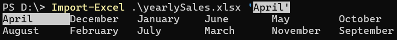
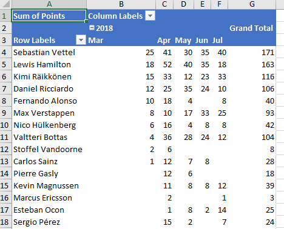
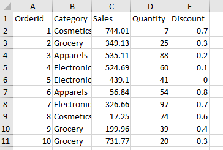

# 7.8.10

- Thank you https://github.com/evenmartinsen for the PR to fix the AV

# 7.8.9

- Thanks to (Edward Miller)[https://github.com/edwardmiller-mesirow] for improving `ConvertTo-ExcelXlsx`and making it more robust

# 7.8.8

- Fix the release

# 7.8.7

- Thanks to [Phil Bossman](https://github.com/pbossman) for the PR and fixing this.
    
    Now, back again, you can type `Import-Excel .\yearlySales.xlsx`, press <ctrl+space> and get a list of the worksheets in the Excel file

        

# Infrastructure change

- Thank you to [RipFence](https://github.com/RipFence) who asked how to place a chart on a different sheet from the data and then did a PR adding the example.
- added `ignore` so files checked into examples do not trigger a CI run

# 7.8.6

- Thank you [John Boyne](https://github.com/kyllath)
    - Add missing parameter aliases to align with caller/callee

# 7.8.5

- Added `Get-ExcelFileSchema` to get the schema of an Excel file.
- This was added to support interacting with `ChatGPT`. Passing the schema to the `ChatGPT` via `PowerShellAI` let's you ask questions about the data including generating code based on the schema.

```powershell
Get-ExcelFileSchema .\salesData.xlsx
```

```json
{
  "ExcelFile": "salesData.xlsx",
  "WorksheetName": "Sheet1",
  "Visible": true,
  "Rows": 10,
  "Columns": 4,
  "Address": "A1:D10",
  "Path": ".",
  "PropertyNames": [
    "Region",
    "State",
    "Units",
    "Price"
  ]
}
```

# 7.8.x

Thanks to [Thomas Hofkens](https://github.com/thkn-hofa)
- Added `-NoHyperLinkConversion` to `Export-Excel` to no convert data to hyperlinks. [#1316](https://github.com/dfinke/ImportExcel/issues/1316)

# 7.8.4

- Add -ShowOnlyIcon to `New-ConditionalFormattingIconSet` does not show data in the cell, just the icon. Based on this discussion https://github.com/dfinke/ImportExcel/discussions/1340

# 7.8.3

Thanks [Thomas Hofkens](https://github.com/thkn-hofa)

- Extended Export-Excel with parameter TableTotalSettings
- New Feature: Set-CellComment
- Fix Pester error for countries with ',' as decimal separator
- Fix Pester error for Windows PowerShell 5.1

# 7.8.2

- Fix docs [#1254](https://github.com/dfinke/ImportExcel/pull/1251)`Add-Worksheet` warning. Thank you [Wilson Stewart](https://github.com/WilsonStewart)
- Fix docs [#1251](https://github.com/dfinke/ImportExcel/pull/1251)`Add-Worksheet` warning. Thank you [Jeremiah Adams](https://github.com/JeremiahTheFirst)
- Fix docs [#1253](https://github.com/dfinke/ImportExcel/pull/1253) `convertfrom-exceltosqlinsert`. Thank you [Wes Stahler](https://github.com/stahler)
- Set Validate Range for rows to max rows available [#1273](https://github.com/dfinke/ImportExcel/pull/1273). Thank you [Stephen Brown](https://github.com/steve-daedilus)
- Extended Get-ExcelFileSummary to include more Visible -eq $true|$false

# 7.8.1

- Fixed conditional formatting so it recognizes 'Top and Bottom' as a rule type. Thanks [g-pearl](https://github.com/g-pearl)
* Update open-excelpackage.md. Thanks [stahler](https://github.com/stahler)
- Added Group Column tests 


# 7.8.0
Thanks [James O'Neill](https://github.com/jhoneill)

- Updated example Get-ModuleStats that extracts module statistics on the PowerShell Gallery.
- Added GroupNumericColumn and GroupDateColumn to New-PivotTableDefinition and Add-PivotTable.

|GroupNumericColumn|GroupDateColumn|
|:---:|:---:|
|||

# Example added

Thank you [@kkazala](https://github.com/kkazala) 

- Added an example reading a sheet, extracting the `ConditionalFormatting` and generating the PowerShell statements so you can re-create them.
- Added an example showing `ConditionalFormatting` using the `RuleType` `Expression` with a formula
    - [Highlight-DiffCells.ps1](https://github.dev/kkazala/ImportExcel/blob/b53881fd023c052da1acc7812511da223bb2e40c/Examples/ConditionalFormatting/Highlight-DiffCells.ps1)

# 7.7.0

- Fix a bug with `-UnderLineType parameter is ignored in Set-ExcelColumn` [#1204](https://github.com/dfinke/ImportExcel/issues/1204)

# 7.6.0

- **_[Under investigation]_** Fix -StartRow and -StartColumn being ignored.
- James O'Neill: 
    - Update Get-HtmlTable to support to use PowerHTML (maintained by [Justin Grote](https://twitter.com/JustinWGrote)). 
    - Added example to including a new function Import-ByColumn. Works like Import-Excel but with data in columns instead of the conventional rows.
- Update Import-HTML with better defaults
- Fixed example `Get-ModuleStats.ps1` which reads the PowerShell Gallery page and extracts the stats table


# v7.5.2
- Changed the switch `-NotAsDictionary` to `-Raw`. Works with `-Worksheetname *` reads all the sheets in the xlsx file and returns an array.

# v7.5.1
- Fixed `Import-Excel` - Reset `EndRow` and `EndColumn` in the correct place.
# v7.5.0
## Fixes

- Importing multiple files with Import-Excel by pipeline uses only the first file for the row count https://github.com/dfinke/ImportExcel/issues/1172

## New Features

- Import-Excel now supports importing multiple sheets. It can either return a dictionary of all sheets, or as a single array of all sheets combined.
    - `Import-Excel $xlfile *`                  # reads all sheets, returns all data in a dictionary
    - `Import-Excel $xlfile * -NotAsDictionary` # reads all sheets, returns all data in a single array
- Added helper functions. Useful for working with an Excel package via `Open-ExcelPackage` or `-PassThru` 
    - `Enable-ExcelAutoFilter`
    - `Enable-ExcelAutofit`
    - `Get-ExcelSheetDimensionAddress`

# v7.4.2

- Thank you [James Mueller](https://github.com/jamesmmueller) Updated `ConvertFrom-ExcelToSQLInsert` to handle single quotes in the SQL statement.

- Thank you to Josh Hendricks
    - Add images to spreadsheets. [Check it out](https://github.com/dfinke/ImportExcel/tree/master/Examples/AddImage)
        - Catch up with him on [GitHub](https://github.com/joshooaj) and [Twitter](https://twitter.com/joshooaj) for the idea

# v7.4.1

- Implements: https://github.com/dfinke/ImportExcel/issues/1111
- Refactored ReZip into separate function
- Deletes temp folder after rezipping
- Added -ReZip to `Close-ExcelPackage`

# v7.4.0

- Thank you to [Max Goczall](https://github.com/muschebubusche) for this contribution!
    - `ImportColumns` parameter added to `ImportExcel`. It is used to define which columns of the ExcelPackage should be imported.

```powershell
Import-Excel -Path $xlFile -ImportColumns @(6,7,12,25,46)
```

# v7.3.1

- Added query Excel spreadsheets, with SQL queries!

```powershell
$query = 'select F2 as [Category], F5 as [Discount], F5*2 as [DiscountPlus] from [sheet1$A2:E11]'

Invoke-ExcelQuery .\testOleDb.xlsx $query
```



## Result

```
Category    Discount DiscountPlus
--------    -------- ------------
Cosmetics        0.7          1.4
Grocery          0.3          0.6
Apparels         0.2          0.4
Electronics      0.1          0.2
Electronics        0            0
Apparels         0.8          1.6
Electronics      0.7          1.4
Cosmetics        0.6          1.2
Grocery          0.4          0.8
Grocery          0.3          0.6
```

- Thank you to Roy Ashbrook for the SQL query code. Catch up with Roy:

|Media|Link|
|---|---|
|twitter|https://twitter.com/royashbrook
|github|https://github.com/royashbrook
|linkedin|https://linkedin.com/in/royashbrook
|blog|https://ashbrook.io

# v7.3.0

- Fix throwing error when a Worksheet name collides with a method, or property name on the `OfficeOpenXml.ExcelPackage` package

# v7.2.3

- Fix inline help, thank you [Wes Stahler](https://github.com/stahler)

# v7.2.2

- Improved checks for Linux, Mac and PS 5.1

# v7.2.1

- Improve auto-detection of data on the clipboard

# v7.2.0

- Added `Read-Clipboard` support for Windows. Read text from clipboard. It can read CSV or JSON. Plus, you can specify the delimiter and headers.

### Check out the video
<a href="https://youtu.be/dv2GOH5sbpA"></a>