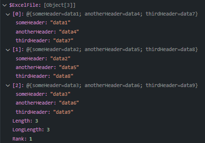

# How to Read an Existing Excel File
## Enumerate the Excel File Contents
```powershell
#Load the Excel file into a PSCustomObject
$ExcelFile = Import-Excel "C:\Test\file.xlsx" -WorksheetName "Sheet1" 
```

## Visual of Data Structure
The File C:\Test\file.xlsx contains  


After loading this data into ```$ExcelFile``` the data is stored like:  


## Other Common Operations

### Load a Column
```powershell
$SpecificColumn = $ExcelFile."anotherHeader" #loads column with the header "anotherHeader" -- data stored in an array
```

### Load a Row
```powershell
$SpecificRow = $ExcelFile[1] #Loads row at index 1. Index 1 is the first row instead of 0. 
```

### Map Contents to Hashtable to Interpret Data
Sometimes mapping to a Hashtable is more convenient to have access to common Hashtable operations. Enumerate a Hashtable with the row's data by:
```powershell
$HashTable = @{}
$SpecificRow= $ExcelFile[2]
$SpecificRow.psobject.properties | ForEach-Object { 
    $HashTable[$_.Name] = $_.Value
}
```
To then iterate through the enumerated Hashtable:
```powershell
ForEach ($Key in ($HashTable.GetEnumerator()) | Where-Object {$_.Value -eq "x"}){ #Only grabs a key where the value is "x"
    #values accessible with $Key.Name or $Key.Value
}
```
